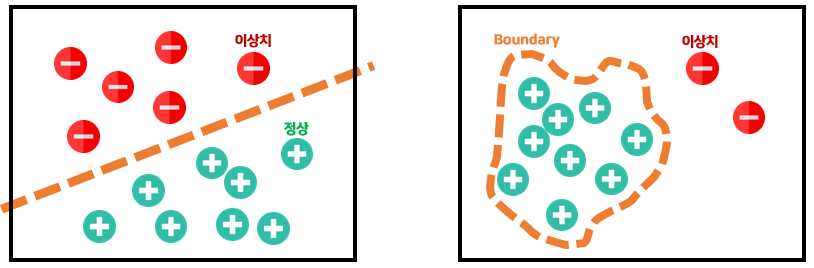
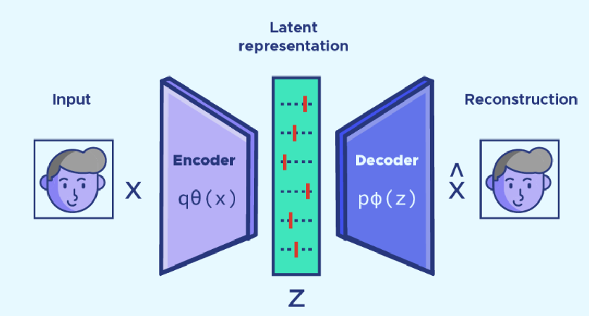
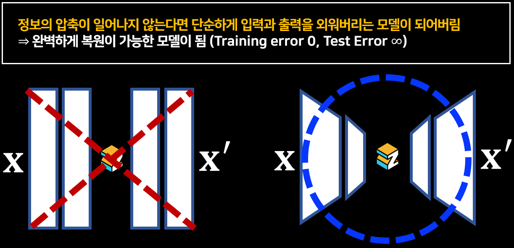
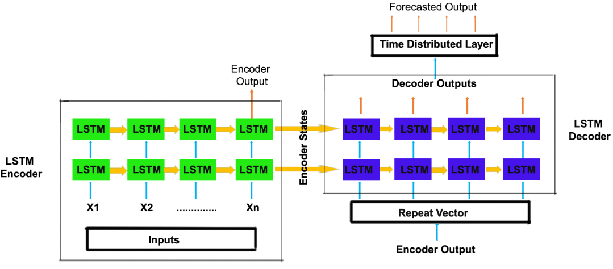

# :books: Anomaly Detection

## 1. 이상 탐지(Anomaly Detection)란?
`이상 탐지(anomaly detection)`은 '정상' 상황을 벗어난 데이터를 찾는 작업입니다. 이상치 데이터를 정의하는 데에는 다음과 같은 2가지 관점이 존재합니다.
1. 데이터 생성 메커니즘 관점: 일반적인 데이터와는 다른 메커니즘에서 생성된 관측치(Hawkins., 2006)
2. 분포에서의 밀도 관점: 실제 확률 밀도가 매우 낮은 관측치(Harmeling et al., 2006)
이러한 이상치는 적지만 매우 중요한 데이터라고 할 수 있기에 무조건적으로 삭제하는 것은 옳지 않다. 

이상치 탐지 알고리즘과 분류 알고리즘의 차이를 확인해보자. 분류 알고리즘을 사용할 것인지 아니면 이상 탐지 알고리즘을 사용할 것인지는 아래의 두 가지 기준으로 보면 된다. 
`1. 클래스 불균형이 심각한가? (0.01:0.99)` 
`2. '이상' 관측치의 절대적인 수가 적은가? (10000:990000)`
- 분류: '정상'과 '이상'을 둘 다 보여주고 특성을 학습 (supervised learning)
- 이상치 탐지: 소수의 '이상' 데이터가 있으나 이를 무시하고 '정상' 데이터만 사용 (unsupervised learning)
따라서 이상치 탐지 알고리즘은 '정상' 데이터만을 가지고 이들의 결정 경계(boundary)를 형성한 뒤에 해당 경계에 관측치가 들어오는지 아닌지를 보고 판단을 수행한다.

`이상치 탐지 알고리즘의 boundary를 결정하는 데에는 다음과 같은 두 가지 기준이 중요하게 작용한다.`
- `일반화(Generalization)`: 주어진 데이터로부터 정상 범주의 개념을 확장해 가는 것
- `특수화(Specialization)`: 주어진 데이터로부터 정상 범주의 개념을 좁혀 가는 것

일반화가 크다면 boundary가 크게 결정되고 따라서 정상에 대한 오류인 false alarm은 적으나 이상치를 민감하게 탐지하지는 못한다. 반대로 특수화가 크다면 boundary가 타이트하게 결정되고 이에 따라 이상치는 민감하게 탐지할 수 있으나 false alarm이 다수 발생한다.
   

## 1. Auto-Encoder (AE)란?
- 입력과 출력이 동일한 인공 신경망 구조를 가진다.
- 원본 데이터 $x$를 압축하고 압축된 데이터 $z$를 원본 데이터와 같은 차원이 되도록 복원한다.
- 원본 데이터와 복원된 데이터 $x'$의 차이를 통하여 `재구축 오차(reconstruction error)`를 계산한다.
$$L(f(x)) = \frac{1}{2}\sum{(\hat{x_i}-x_i)^2}$$
- 정상 데이터에 대한 학습이 잘 되어있는 경우, 이상 관측치(anomaly)들은 잘 복원되지 않을 것이라는 가정으로 접근하는 방법론
- 잘 복원되지 않은, 즉 재구축 오차가 큰 관측치들을 찾아 이상으로 정의함
=> ‘정상‘ 데이터로 모델을 구축했기에 ‘이상‘ 데이터는 복원을 잘 못함
- Latent vector의 차원은 입력 차원보다 반드시 작아야한다. 그렇지 않으면 정보의 압축이 일어나지 않아 단순하게 입력과 출력을 외워버리는 모델이 된다. (완벽하게 복원이 가능한 모델이 된다.)

    
  

---
## 2. LSTM-AE란?
- Encoder-Decoder LSTM 아키텍처를 사용한 시퀀스 데이터용 오토인코더 
- LSTM 레이어를 사용하여 데이터의 시간 종속성을 캡처

- 순서 
    - 이상 데이터(설비의 이상 소음/진동 등)이 입력된다.
    - LSTM AE가 이상 데이터를 재구성한다.
=> 이 때 LSTM AE는 정상 데이터의 특징을 학습했기 때문에, 이상 데이터가 입력됐을 때 재구성 오류(Reconstruction Error)가 정상 데이터를 입력했을 때 보다 크게 발생한다
    - 재구성 오류를 사전에 정의한 Threshold(임계값)과 비교하여 임계값 초과 시 이상 데이터라고 판단한다.

  

---
## 3. LSTM-AE tutorial
- LSTM-AE  [[tutorial](https://github.com/rch1025/Business-Analytics/blob/main/Anomaly%20Detection/LSTM%20AutoEncoder.ipynb)]

---
### :postbox: Reference
- https://datascientest.com/les-autoencoders-modeles-dapprentissage-non-supervise

