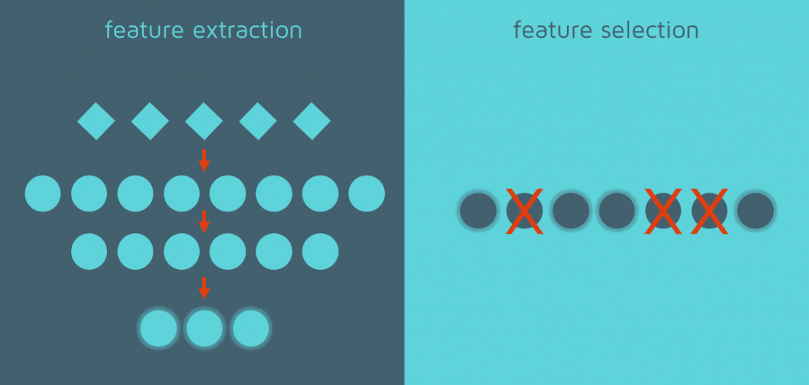
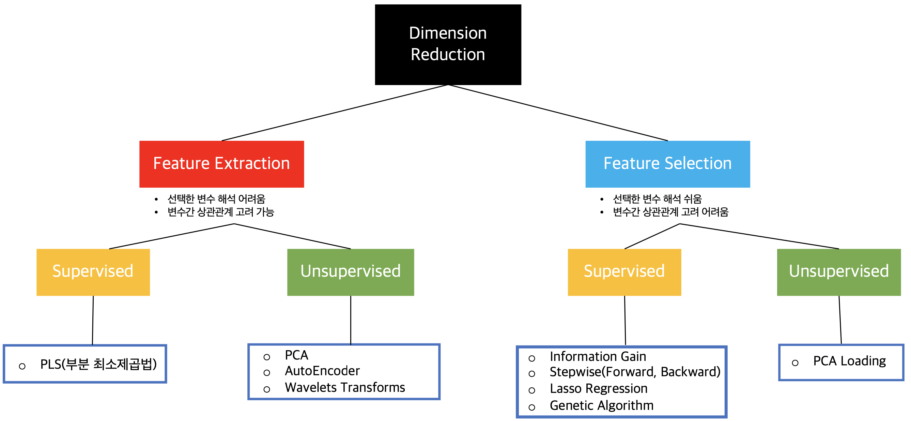

# :books: Dimensionality Reduction

## 1. Dimensionality Reduction이란?
차원 축소는 데이터 셋의 차원 감소를 통해 모델의 복잡성을 줄이고, 과적합(overfitting)을 막는 역할을 하며 방법론으로는 크게 `Feature Selection`과 `Feature Extraction`이 있다.   

 
- `Feature Selection`: 전체 변수 중 소수의 변수를 선택하는 기법을 의미한다. 변수 해석이 용이하다는 장점이 존재하나 변수 간의 상관관계를 고려하기 어렵다는 단점이 있다.
- `Feature Extraction`: 기존 변수의 변환을 통해 새로운 변수를 추출한다. Feature Selection과는 다르게 변수 간의 상관관계를 고려할수 있고, 변수의 개수를 많이 줄일 수 있다는 장점이 있다.  

Feature Selection과 Feature Extraction 각 방법론은 종속변수를 고려하여 변수를 추출 (또는 선택) 하는지에 따라 `supervised`와 `unsupervised`로 나눌 수 있다.
 

 

---
## 2. Dimensionality Reduction Tutorial
1. LDA  [tutorial](https://github.com/rch1025/Business-Analytics/blob/main/Dimensionality%20Reduction/LDA%20tutorial.ipynb)
- 클래스 내의 분산은 최소화하고, 클래스 간의 분산을 최대화하는 방법론이다.
- PCA와 같이 고차원의 feature를 저차원 공간으로 투영시킨다.
- 아래와 같은 4가지 제약 조건이 존재한다.
    - 결과 변수와 예측 변수 유형의 제약
    - 예측 변수 분포의 제약
    - 변수들 간의 상관관계 제약
    - 결과변수 클래스별 공분산 행렬의 제약
2. t-SNE [tutorial](https://github.com/rch1025/Business-Analytics/blob/main/Dimensionality%20Reduction/t-SNE%20tutorial.ipynb)
- 고차원과 저차원의 데이터간 확률적인 관계를 같게 하고자 하는 방법론이다.
- Neighbor identity를 deteministic하게 정의한 t-SNE 이전의 방법론들과 다르게 probabilistic한 방법론을 사용한다.
- 시각화에 용이하며 local 구조를 유지함과 동시에 일부 중요한 global 구조를 드러낼 수 있다.

---
### :postbox: Reference
1.  https://quantdare.com/what-is-the-difference-between-feature-extraction-and-feature-selection/
2.  https://techblog-history-younghunjo1.tistory.com/174
