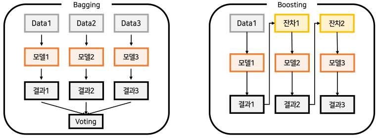
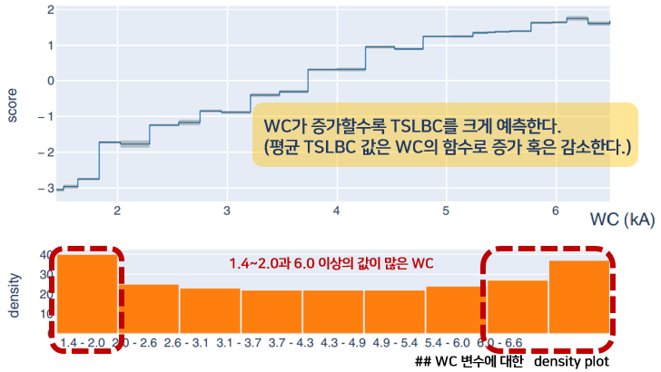

# :books: Ensemble Learning

## 1. 앙상블(Ensemble)이란?
`앙상블 학습(Ensemble Learning)`은 하나의 데이터에 대한 여러 모델의 결과를 종합하는 것을 의미한다. 여러 개의 learner를 생성하고, 그 예측 결과를 결합함으로서 더 정확한 최종 예측을 도출해낸다.

앙상블의 종류에 대해서 알아보자.
- 앙상블은 전총적으로 Voting, Bagging, Boosting, Stacking으로 나뉜다. 
- Voting과 Bagging은 여러 개 모델의 투표를 통해 최종 예측 결과를 결정한다.
- Voting은 각각 다른 모델을 사용하지만 Bagging은 모두 같은 모델을 사용한다.
- 대표적인 Bagging 방법론은 Random Forest가 있다.  

## 2. 앙상블을 통한 성능 향상 조건
앙상블은 무조건적인 성능 향상을 보장하진 않는다.
1. `개별 모델은 어느 정도 좋은 성능을 가지는가`
2. `개별 모델의 예측 결과가 모두 같지 않은가`
3. `개별 모델은 무작위로 예측한 결과보다 성능이 좋은가`  

## 3. Independent(implicit) vs. Model guided(explicit) instance selection
- Implicit diversity: 각 learner에 대한 훈련 데이터의 무작위 하위 집합이 입력 -> `Bagging`
- Explicit diversity: 후속 learner를 이전 learner와 다르게 하여 입력 -> `Boosting`

`이상치 탐지 알고리즘의 boundary를 결정하는 데에는 다음과 같은 두 가지 기준이 중요하게 작용한다.`
- `일반화(Generalization)`: 주어진 데이터로부터 정상 범주의 개념을 확장해 가는 것
- `특수화(Specialization)`: 주어진 데이터로부터 정상 범주의 개념을 좁혀 가는 것

일반화가 크다면 boundary가 크게 결정되고 따라서 정상에 대한 오류인 false alarm은 적으나 이상치를 민감하게 탐지하지는 못한다. 반대로 특수화가 크다면 boundary가 타이트하게 결정되고 이에 따라 이상치는 민감하게 탐지할 수 있으나 false alarm이 다수 발생한다.
   

---
## 4. Explainable Boosting Machine (EBM)이란?
- 높은 예측 성능과 관측치별 모델 의사결정까지 알 수 있는 알고리즘이다. (Bagging, Boosting 계열의 모델들과 동등한 수준을 보인다.)
- Test 데이터에 대한 inference 시의 속도가 비교 모델들 보다 빠르다.
- 최종 예측에 대한 다양한 해석 형태를 볼 수 있다.
- 일반화 가법 모델 (GAM)의 발전된 형태인 GA2M 모델의 한 종류이다.  

## 4. Explainable Boosting Machine (EBM)의 특징
- EBM은 일반화된 가법 모델(eneralized additive model (GAM))이다.
    - 기존의 회귀법: $Y=\beta_0+\beta_1x_1+\beta_0x_2+...$
        - 선형 보델은 해석 가능성이 높지만 복잡한 모델에서 제공하는 높은 정확도를 제공하지 않는 경우가 많다.
    - GAM: $Y=\beta_0+f(x_1)+f(x_2)+...$ => 예측 변수에 대한 각 기여는 함수 $f()$
        - 선형 모델의 문제점을 해결하기 위해 통계학자들은 가법 구조(선형 모델의 상호 확률)를 유지하면서도 더 유연하고 정확하게 만드는 GAM(일반화 가법 모델)을 만들었다.
        - GAM의 $f()$는 spline 함수이다.
    - EBM: $Y=\beta_0+f(x_1)+f(x_2)+...$ => $f()$는 배깅 or 부스팅 알고리즘
- `EBM의 작동 방식`
    - 데이터셋에 n개의 feature가 존재한다고 할 때 EBM은 다음과 같이 작동한다.
    1. EBM은 feature1만을 기반으로 tree를 생성하고 부스팅 알고리즘을 사용하여 잔차를 다음 tree로 전달한다.
    2. 이제 feature2를 보고 잔차를 전달할 수 있는 tree를 훈련시킨다.
    3. n개의 feature들에 대해 순차적으로 진행된다.
    4. 각 feature에 대한 tree 모델링의 반복과 잔차 전달은 iteration만큼 수행할 수 있다. 
    5. 이러한 방식으로 각 feature에 대한 최상의 feature function $f()$를 찾고 각 feature가 문제에 대한 모델의 예측에 어떻게 기여하는지 보여준다.

  

## 5. EBM과 GAM의 차이점
- EBM은 기존의 GAM 방식과 크게 두 가지 차이점이 있다.
    1. `EBM에서의 feature function $f()$는 최신의 머신러닝 기술인 배깅 혹은 부스팅 알고리즘으로 이루어져 있다.`
    2. `EBM은 자동으로 변수 간의 쌍별 상호작용을 포착하여 반영한다. => 해석력을 주는 동시에 정확도를 증가시킨다.`
- 최종 예측값에 대한 각 feature의 기여도는 $f_j$를 시각화 함으로써 알 수 있기에 매우 쉽게 이해할 수 있다.
- `EBM은 additive model이기 때문에 각 feature는 모듈(additivity) 방식으로 예측에 기여한다.`
- 각 함수 $f_i$는 feature별 조회 테이블 역할과 기여도를 반환한다. 모듈성(가산성)으로 인해 기여도를 정렬하고 시각화하여 개별 예측에 가장 큰 영향을 미친 feature를 표시할 수 있다.
- Individual terms additivity 때문에 EBM은 학습 비용이 더 들어 비슷한 방법론들에 비해 약간 느리다.
- EBM의 가벼운 메모리 사용량과 빠른 예측 시간은 프로덕션 환경에서 모델을 배포하는데 특히 매력적이라고 할 수 있다.  

---
## 3. LSTM-AE tutorial
- LSTM-AE  [[tutorial](https://github.com/rch1025/Business-Analytics/blob/main/Anomaly%20Detection/LSTM%20AutoEncoder.ipynb)]

---
### :postbox: Reference
- Paper link: https://arxiv.org/abs/1909.09223
- Reference link
    - https://medium.com/analytics-vidhya/model-interpretation-with-microsofts-interpret-ml-85aa0ad697ae
    - Santos, J. I., Martín, Ó., Ahedo, V., de Tiedra, P., & Galán, J. M. (2022). Glass-box modeling for quality assessment of resistance spot welding joints in industrial applications. The International Journal of Advanced Manufacturing Technology, 1-16.
    - Nori, H., Jenkins, S., Koch, P., & Caruana, R. (2019). Interpretml: A unified framework for machine learning interpretability. arXiv preprint arXiv:1909.09223.
    - 비즈니스 애널리틱스, 강필성 교수님의 Ensemble Learning 수업
