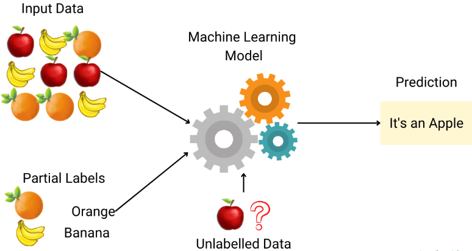

# :books: Semi-supervised Learning
`Semi-supervised Learning`은 입력 데이터가 있고 일부 입력 데이터에만 레입르이 지정되는 기계 학습의 범주이다. 준지도 학습은 부분적으로 지도되고 부분적으로 비지도 학습이다.
    
   

## 1. Semi-supervised Learning은 왜 필요한가
딥러닝 알고리즘은 다양한 도메인에서 우수한 성능을 보여주고 있다. 좋은 성능을 내는 딥러닝 알고리즘의 경우 대용량의 labeled data가 필요하다. 현실문제에서 다량의 labeled data를 구축하는 것은 여러 제약이 있다. (많은 시간, 비용, 전문적 지식 등) 따라서 labeled data가 불충분한 경우에도 효과적으로 활용이 가능한 다양한 연구들이 제안되었다. Labeled data가 불충분한 경우, 충분히 확보된 unlabeled data를 함께 활용하여 해결하는 것이다. 여기에는 Semisupervised Learning 방식과 Self-supervised Learning 방식이 있다.
- Semi-supervised Learning: One-stage 단계
- Self-supervised Learning: Two-stage 단계

## 2. Semi-supervised Learning에 있어서 Main assumption
- Smoothness Assumption: 확률밀도가 높은 입력 값 $x_1$과 $x_2$가 가깝다면 $y_1$과 $y_2$가 같은 레이블일 확률이 높다.
- Low-Density Assumption: 모델의 결정경계는 확률밀도가 낮은 곳에서 정의 된다.
- Manifold Assumtion: 고차원의 입력데이터가 저차원 공간에서는 공간에서는 고유의 구조(manifold)의 형태를 가지며, 고차원에서 $x_1$과 $x_2$가 가깝다면 저차원에서의 $z_1$과 $z_2$는 가깝다.

  
---
## 3. Semi-supervised Learning tutorial
- Semi-supervised Learning  [[tutorial](https://github.com/rch1025/Business-Analytics/blob/main/Semi-supervised%20Learning/Semi%20supervised%20Learning%20tutorial.ipynb)]

---
### :postbox: Reference
- https://www.enjoyalgorithms.com/blogs/supervised-unsupervised-and-semisupervised-learning
- https://www.youtube.com/watch?v=gzbafL28vA0&t=1680s (강필성 교수님의 Business Analytics IME654 강의)